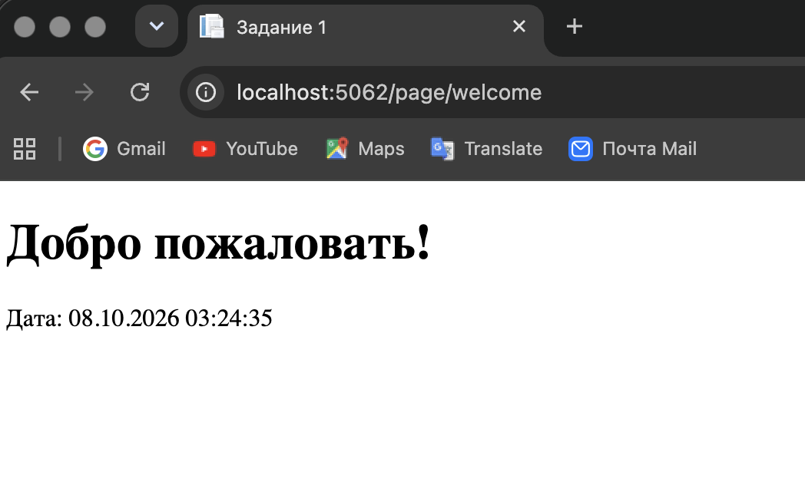

# Задание 1

### Цель: Создать простую веб-страницу, используя ASP.NET Core MVC, чтобы понять основы работы с представлениями и контроллерами.

#### Задача:

- Создайте новый проект ASP.NET Core MVC.

- Добавьте новый контроллер с именем PageController. 

- В контроллере PageController добавьте действие Welcome, которое возвращает представление. 

- Создайте представление Welcome.cshtml в соответствующей папке Views/Page. 

- В представлении Welcome.cshtml используйте теги Razor для отображения сообщения приветствия и текущей даты.

- Отчет: запустите приложение и сделайте скриншоты, показывающие, что по адресу /Page/Welcome отображается ваша веб-страница с приветственным сообщением и текущей датой.

# Задание 2

### Цель: Научиться использовать маршрутизацию для передачи данных в контроллер через URL.

#### Задача:

- Используйте существующий или создайте новый проект ASP.NET Core MVC.

- Добавьте в контроллер PageController новое действие Greet, которое принимает параметр name.

- Настройте маршрутизацию так, чтобы можно было передавать имя через URL в формате /Page/Greet/{name}.

- В действии Greet возвращайте представление, которое использует переданный параметр name для отображения приветственного сообщения.

- Создайте представление Greet.cshtml, которое отображает приветствие пользователю по его имени.

- Отчет: перейдите по адресу /Page/Greet/YourName, заменив YourName на любое имя. Покажите, что страница корректно отображает приветствие с указанным именем.

# Задание 3

### Цель: Попрактиковаться в создании и обработке форм на стороне сервера с ASP.NET Core MVC.

#### Задача:

- В проекте ASP.NET Core MVC добавьте новое действие Edit в PageController, которое отображает форму для редактирования.

- Создайте представление Edit.cshtml с формой, содержащей текстовое поле для ввода сообщения и кнопку для отправки.

- Добавьте еще одно действие Edit (с атрибутом [HttpPost]), которое принимает отправленное сообщение и отображает его на новой странице или в представлении.

- Используйте теги Razor для динамического отображения отправленного сообщения.

- Отчет: Покажите запущенное приложение, в котором перейдите к форме редактирования по адресу /Page/Edit, введите сообщение и отправьте форму. Покажите, что отправленное сообщение отображается на странице.
  

# Задание 4

### Цель: Освоить создание навигационных элементов и их интеграцию в веб-приложение.

#### Задачи:

- В любом проекте ASP.NET Core MVC создайте частичное представление _Navigation.cshtml в папке Views/Shared.

- В частичном представлении создайте навигационное меню с помощью HTML-ссылок на главную страницу, страницу приветствия и форму редактирования.

- Включите частичное представление навигации в основной макет приложения (_Layout.cshtml), используя тег @Html.Partial("_Navigation").

- Добавьте стили для навигационного меню, используя CSS.

- Отчет: продемонстрируйте приложение и покажите, что на всех страницах отображается навигационное меню и позволяет переходить между разделами сайта.

