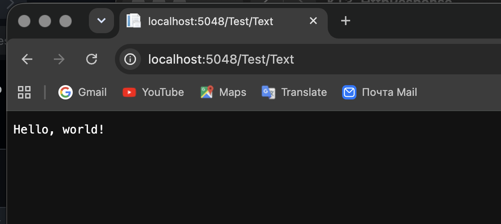
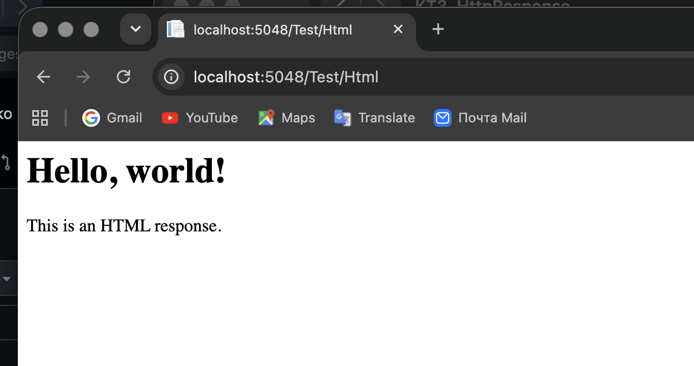
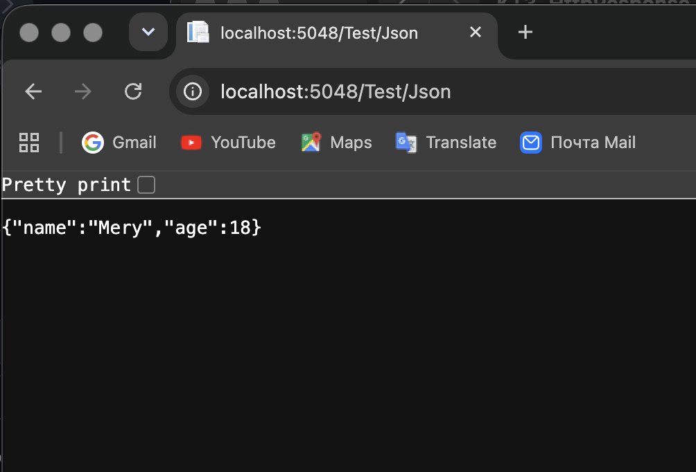
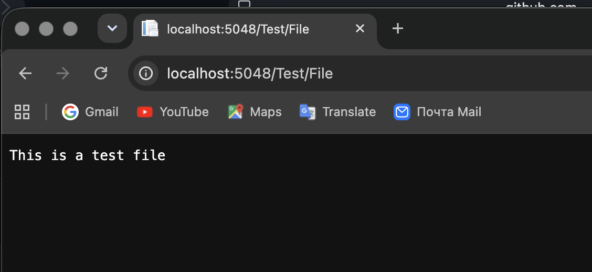
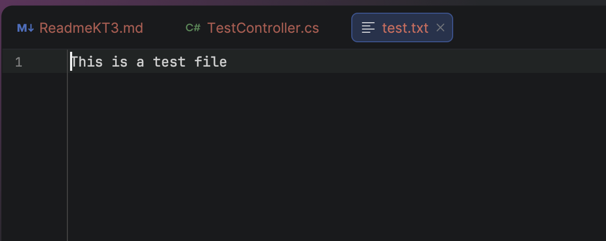
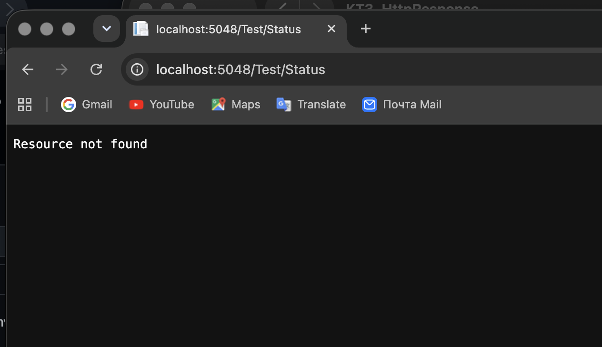
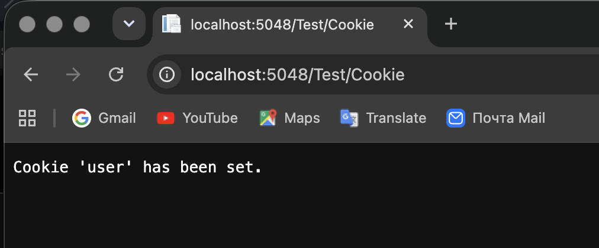

# КТ №3 Отправка ответа
## Задачи:
- Создайте новый проект ASP.NET Core MVC.
- Добавьте новый контроллер с именем TestController в папку Controllers. Унаследуйте его от класса Controller и убедитесь, что он имеет суффикс Controller в имени.
- Добавьте действие с именем Text в контроллер, которое возвращает строку “Hello, world!” в виде текстового ответа. Используйте метод WriteAsync для отправки строки и установите свойство ContentType в “text/plain”.
  
- Добавьте действие с именем Html в контроллер, которое возвращает HTML-код с заголовком и абзацем в виде HTML-ответа. Используйте метод WriteAsync для отправки HTML-кода и установите свойство ContentType в “text/html”.
  
- Добавьте действие с именем Json в контроллер, которое возвращает объект с двумя свойствами: Name и Age в виде JSON-ответа. Используйте метод WriteAsJsonAsync для отправки объекта и установите свойство ContentType в “application/json”.
  
- Добавьте действие с именем File в контроллер, которое возвращает файл с именем test.txt, содержащий строку “This is a test file” в виде файла. Используйте метод SendFileAsync для отправки файла и установите свойство ContentType в “text/plain”.
  
  
- Добавьте действие с именем Status в контроллер, которое возвращает статусный код 404 (Not Found) в виде ответа. Используйте свойство StatusCode для установки статусного кода и метод WriteAsync для отправки сообщения об ошибке.
  
- Добавьте действие с именем Cookie в контроллер, которое устанавливает куки с именем “user” и значением “Answer” в виде ответа. Используйте свойство Cookies для установки куки и метод WriteAsync для отправки подтверждения.
  
- Запустите проект и проверьте, что вы можете получить доступ к каждому действию по соответствующему URL, например, /Test/Text, /Test/Html, /Test/Json и т.д. Обратите внимание, как HttpResponse формирует ответ в зависимости от типа данных и заголовков.