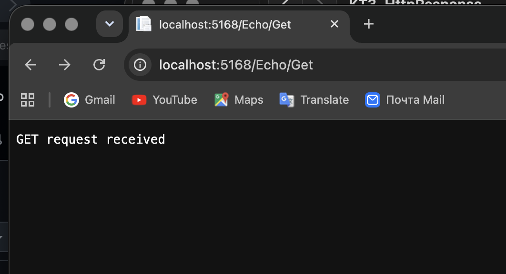
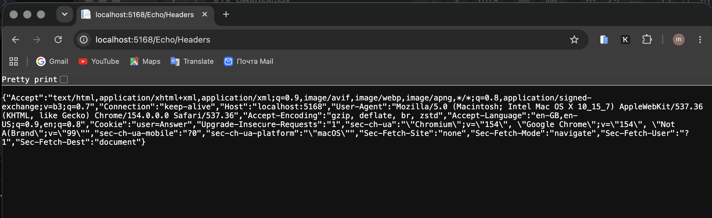
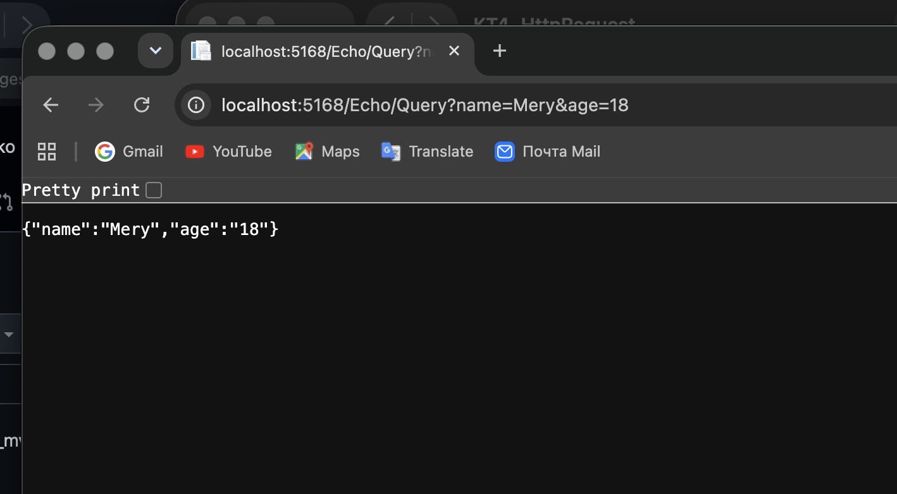
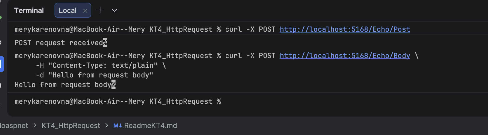

# КТ №4 Получение данных запроса
## Задачи:
- Создайте новый проект ASP.NET Core MVC с помощью Visual Studio или командной строки dotnet.
- Добавьте новый контроллер с именем EchoController в папку Controllers. Унаследуйте его от класса Controller и убедитесь, что он имеет суффикс Controller в имени.
- Добавьте действие с именем Get в контроллер, которое возвращает строку “GET request received” в виде текстового ответа. Используйте атрибут [HttpGet] для указания, что действие обрабатывает только GET-запросы. Используйте метод WriteAsync для отправки строки и установите свойство ContentType в “text/plain”.

- Добавьте действие с именем Post в контроллер, которое возвращает строку “POST request received” в виде текстового ответа. Используйте атрибут [HttpPost] для указания, что действие обрабатывает только POST-запросы. Используйте метод WriteAsync для отправки строки и установите свойство ContentType в “text/plain”.

- Добавьте действие с именем Headers в контроллер, которое возвращает все заголовки запроса в виде JSON-ответа. Используйте свойство Headers для получения заголовков и метод WriteAsJsonAsync для отправки их в виде объекта. Установите свойство ContentType в “application/json”.

- Добавьте действие с именем Query в контроллер, которое возвращает все параметры из строки запроса в виде JSON-ответа. Используйте свойство Query для получения параметров и метод WriteAsJsonAsync для отправки их в виде объекта. Установите свойство ContentType в “application/json”.

- Добавьте действие с именем Body в контроллер, которое возвращает тело запроса в виде текстового ответа. Используйте метод ReadAsStringAsync для чтения тела запроса и метод WriteAsync для отправки его в виде строки. Установите свойство ContentType в “text/plain”.

- Запустите проект и проверьте, что вы можете отправить разные типы запросов к каждому действию по соответствующему URL, например, /Echo/Get, /Echo/Post, /Echo/Headers и т.д. Обратите внимание, как HttpRequest позволяет вам получить доступ к различным аспектам запроса.